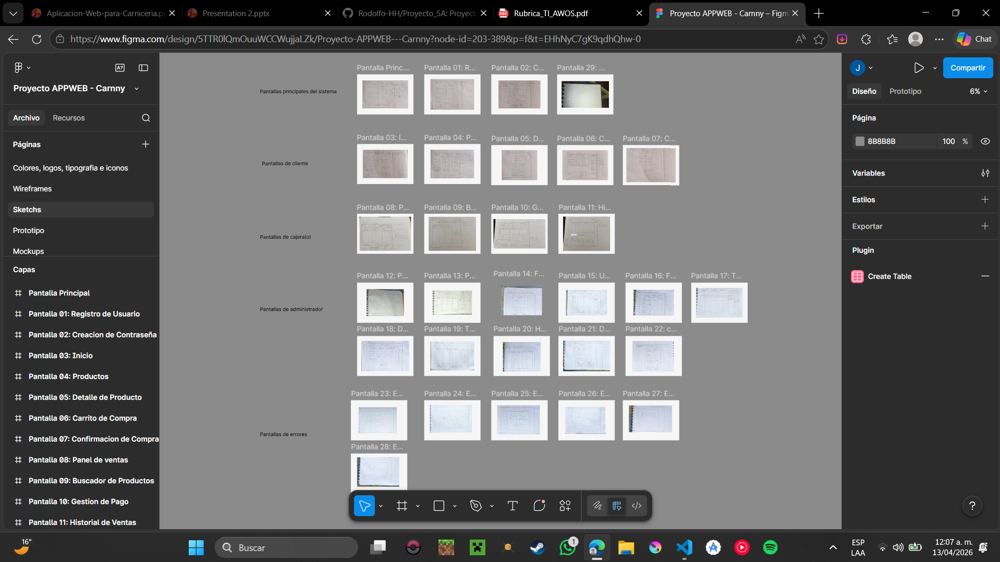
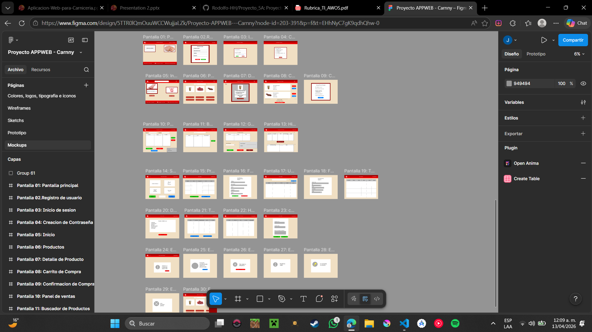
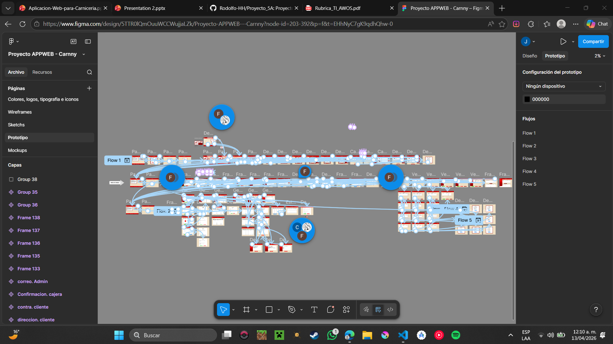

# CARNNY

&gt; Proyecto Integrador - Aplicaciones Web Orientadas a Servicios  
&gt; Abril 2026

## Equipo
- Rodolfo Hernández Hernández 5º "A"
- Fernando Miguel Pérez 5º "A"
- Carlos Alberto Cabrera Solís 5º "A"
- Juan Carlos Cobos Vega 5º "A"

## Descripción
En este proyecto, se desarrollan sketches, wireframes y mockups para planificar y visualizar la interfaz de usuario de manera progresiva, desde ideas iniciales hasta representaciones cercanas al producto final. El enfoque principal está en garantizar una experiencia intuitiva, funcional y visualmente atractiva, alineada con los requerimientos del sistema.

## Tecnologías
- Frontend: HTML, CSS, JS
- Backend: [Node.js/Python/PHP]
- Base de datos: [MySQL/PostgreSQL/MongoDB]

## Estructura

