# CARNNY

&gt; Proyecto Integrador - Aplicaciones Web Orientadas a Servicios  
&gt; Abril 2026

## Equipo de desarrollo

| Integrantes | Contacto | Rol |
|---------------|--------|--------|
| Rodolfo Hernández Hernández | [@Rodolfo-HH](https://github.com/Rodolfo-HH) | Scrum Master: Lider del Equipo y programador backend|
| Fernando Miguel Pérez | [@Fernando33368](https://github.com/Fernando33368) | Lider Desarrollador Frontend |
| Carlos Alberto Cabrera Solís | [@CarlosACS21](https://github.com/CarlosACS21) | Lider de Diseño |
| Juan Carlos Cobos Vega | [@cobosjuan5636](https://github.com/cobosjuan5636) | Lider de Desarrollo de Documentación |

## Descripción

En este proyecto, se desarrollan sketches, wireframes y mockups para planificar y visualizar la interfaz de usuario de manera progresiva, desde ideas iniciales hasta representaciones cercanas al producto final. El enfoque principal está en garantizar una experiencia intuitiva, funcional y visualmente atractiva, alineada con los requerimientos del sistema. 

## Tecnologías
- Frontend: HTML, CSS, JS
- Backend: [Node.js/Python/PHP]
- Base de datos: [MySQL/PostgreSQL/MongoDB]

## Estructura de archivos
>| - Backend  
>| - Docs  
> &nbsp;&nbsp;|- UIUX/Figma 
> &nbsp;&nbsp;&nbsp;&nbsp;| - **readme.md**  
> &nbsp;&nbsp;|- contexto 
> &nbsp;&nbsp;&nbsp;&nbsp;| - BRs  
> &nbsp;&nbsp;&nbsp;&nbsp;| - FRs  
> &nbsp;&nbsp;&nbsp;&nbsp;| - NFRs  
> &nbsp;&nbsp;&nbsp;&nbsp;| - UHs  
> &nbsp;&nbsp;&nbsp;&nbsp;| - URs  
> &nbsp;&nbsp;| - presentation  
> &nbsp;&nbsp;&nbsp;&nbsp;| - readme.md  
> &nbsp;&nbsp;| - prompting  
> &nbsp;&nbsp;&nbsp;&nbsp;| - img  
> &nbsp;&nbsp;&nbsp;&nbsp;| - readme.md  
>| - Frontend 
>| - api 
>| - node_modules 
>| - test  

## Explicación de los cinco tipos de paginas que se hicieron para hacer el diseño de las pantallas web.

## Primer pagina:

1. **Colores, logos, tipografia e iconos**

En esta parte se hizo la vectorización del logotipo que se va a usar en las pantallas de la aplicación web, ademas de eso, se selecciono la tipografia a usar y determinar en que se va a usar cada una. De igual manera se seleccionaron los colores que se llevarian a cabo para el estilo de la aplicación. 

https://www.figma.com/design/5TTR0lQmOuuWCCWujjaLZk/Proyecto-APPWEB---Carnny?node-id=335-83&t=KSUlkOQhxKKNlonm-1

<table border="3">
    <tr>
        <td>
            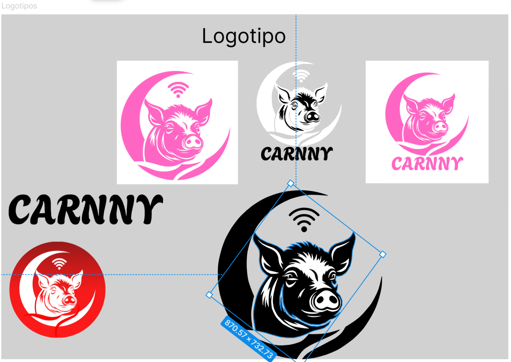
        </td>
        <td>
            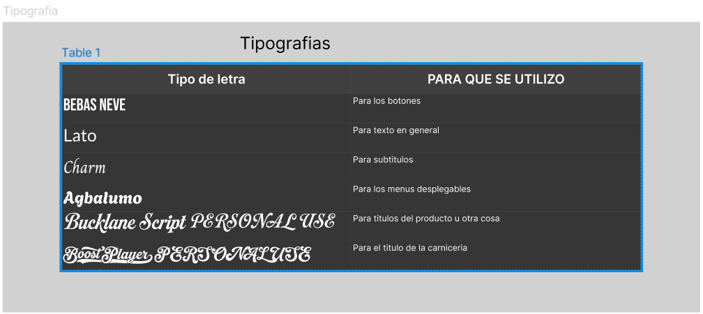
        </td>
    </tr>
    <tr>
        <td>
            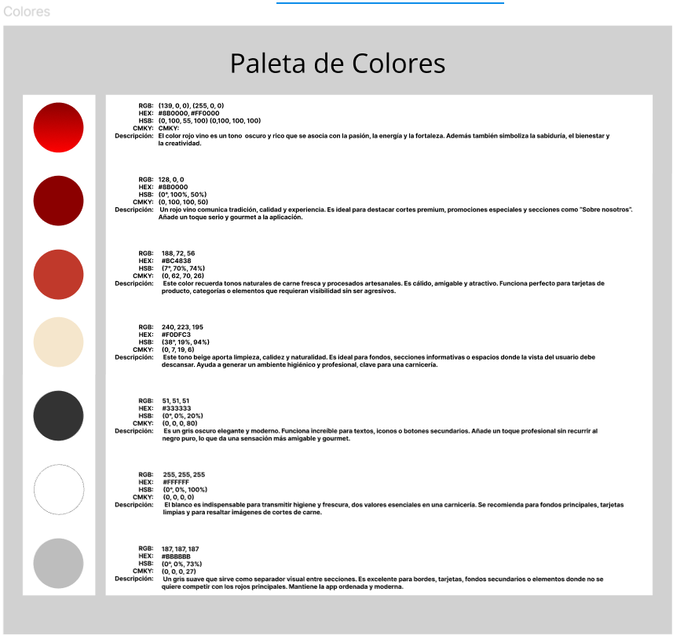
        </td>
        <td>
            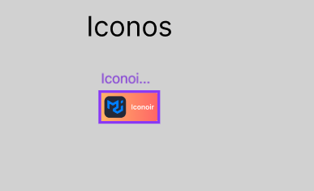
        </td>
    </tr>
</table>

En los iconos, como tal se sacaron de Iconoir (Free Icons)

 
 

2. **Sketchs**

En esta parte se subieron los sketch, dibujos o ideas diseñados para ver como quedaria la aplicación web, se diseñaron 4 roles, aunque en realidad son 3, ya que el sistema no se cuenta como tal. los tres roles son Cliente, Cajera(o) o Administrador.

https://www.figma.com/design/5TTR0lQmOuuWCCWujjaLZk/Proyecto-APPWEB---Carnny?node-id=203-389&t=KSUlkOQhxKKNlonm-1

<table border="3">
    <tr>
        <td>
            Sistema  
            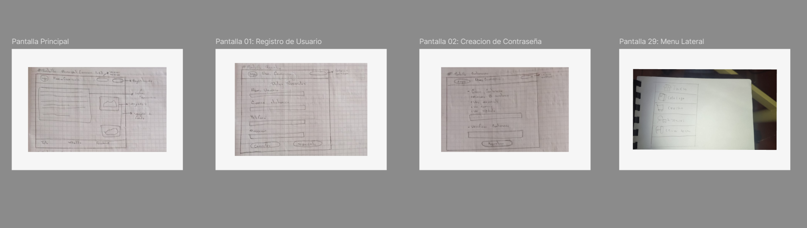
        </td>
        <td>
            Cliente  
            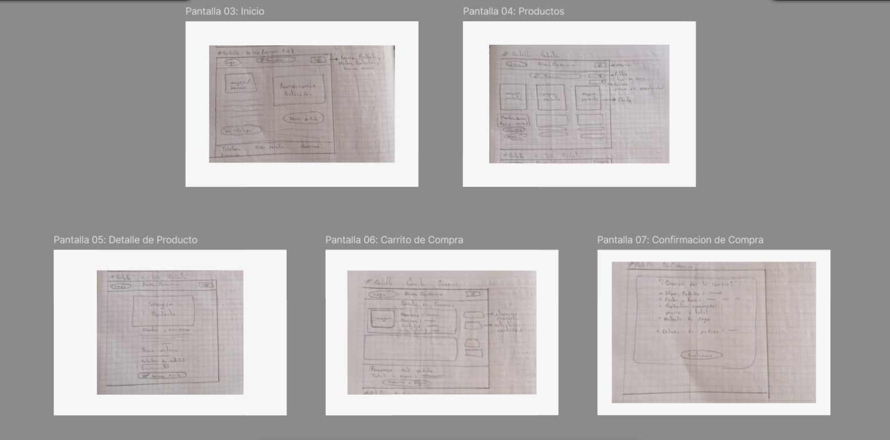
        </td>
    </tr>
    <tr>
        <td>
            Cajera(o)  
            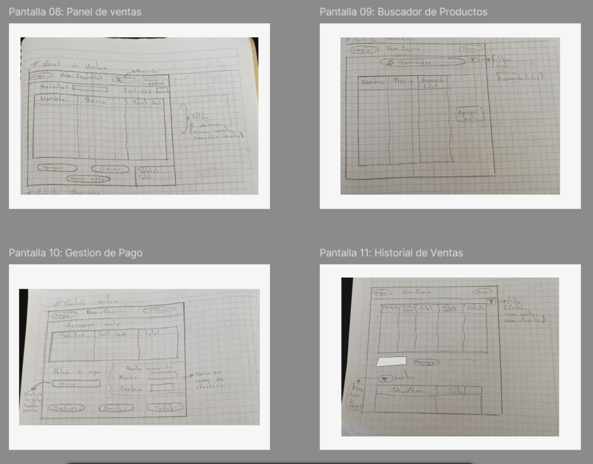
        </td>
        <td>
            Administrador  
            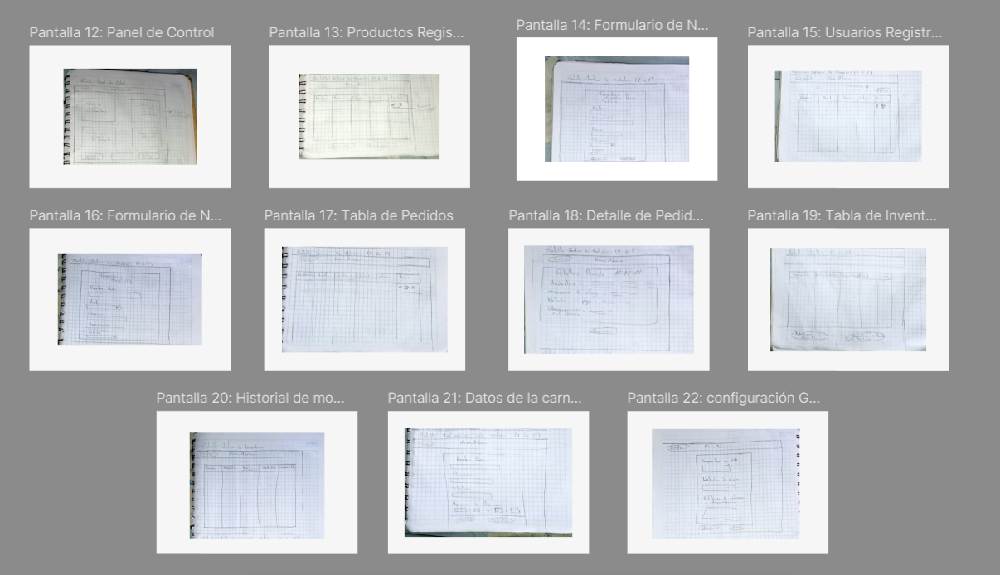
        </td>
    </tr>
</table>

 
 

3. **Wireframes**

En esta parte se diseñaron los wireframes, una representación visual basica de la estructura y diseño de una interfaz de usuario, asi mismo, para ver como quedaria la aplicación web.

https://www.figma.com/design/5TTR0lQmOuuWCCWujjaLZk/Proyecto-APPWEB---Carnny?node-id=203-389&t=KSUlkOQhxKKNlonm-1

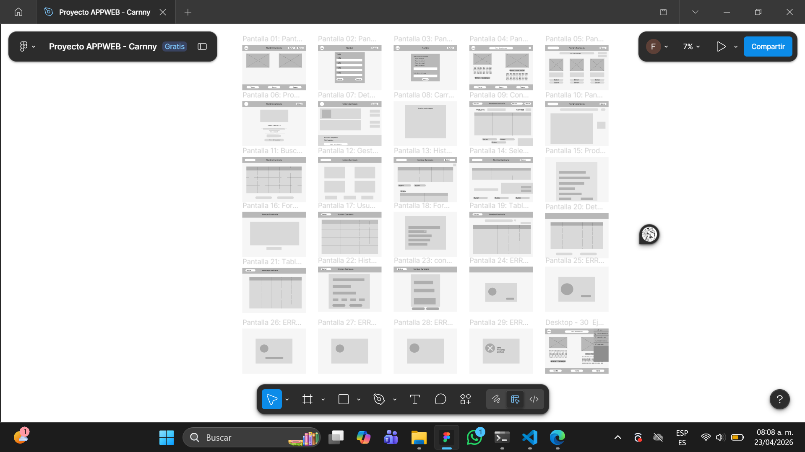

 
 

4. **Mockups**

En esta parte se diseñaron los mockups un modelo o maqueta visual que nos permite mostrar como se veria el diseño final antes de la implementación.

https://www.figma.com/design/5TTR0lQmOuuWCCWujjaLZk/Proyecto-APPWEB---Carnny?node-id=203-389&t=KSUlkOQhxKKNlonm-1

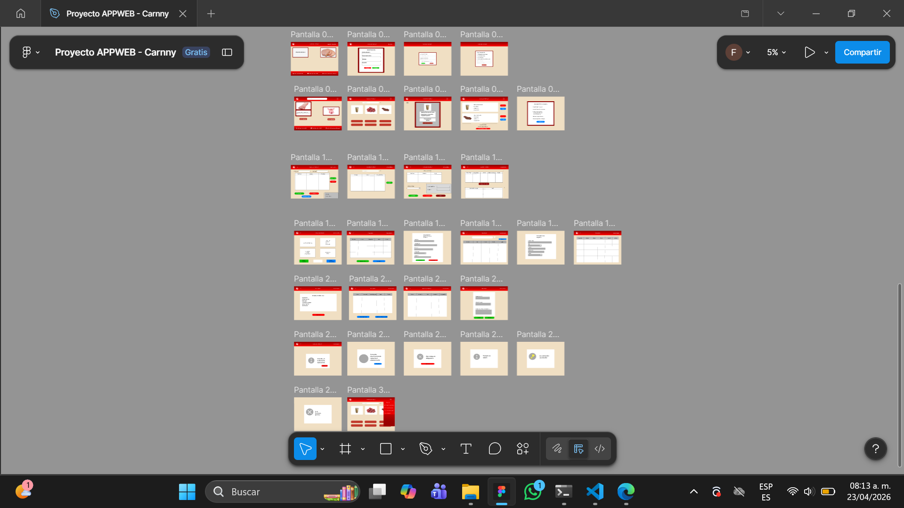

 
 

5. **Prototipo**

En esta parte se diseño el prototipado, es decir, una maquina de pruebas que es diseñada para la demostración de la aplicación web, ver el como funcionaria en cada rol. 

En esta parte del prototipo se extendio mucho, ya que pues de una sola pantalla pues sale una y otra y otra. Por eso es que se extendio.

https://www.figma.com/design/5TTR0lQmOuuWCCWujjaLZk/Proyecto-APPWEB---Carnny?node-id=203-389&t=KSUlkOQhxKKNlonm-1

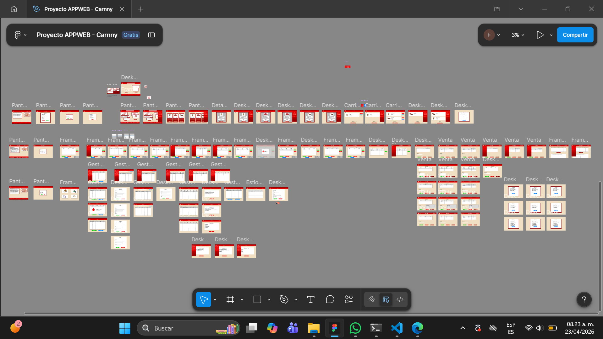
