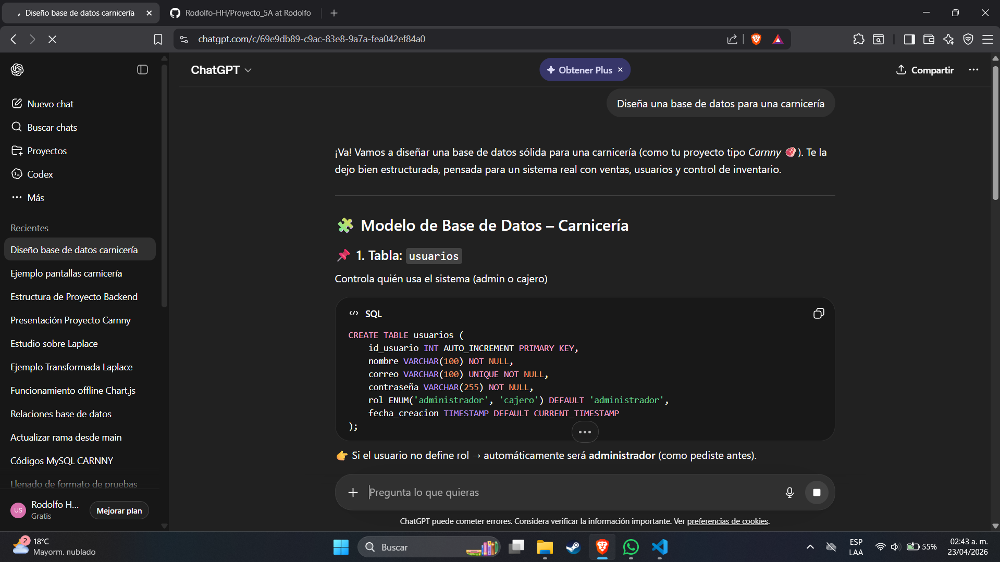
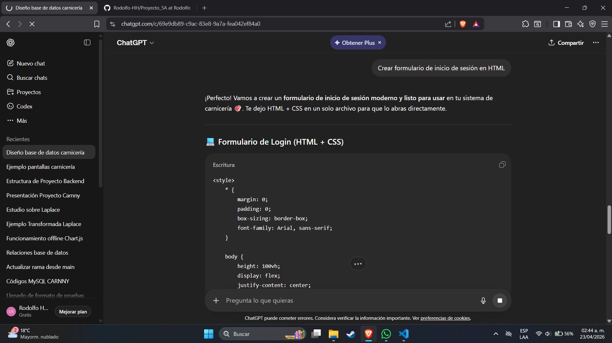
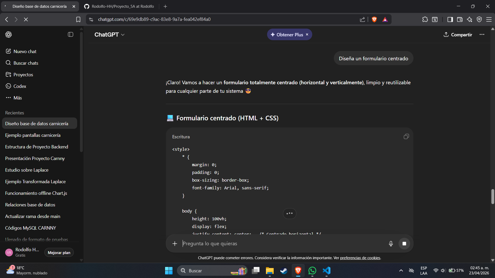
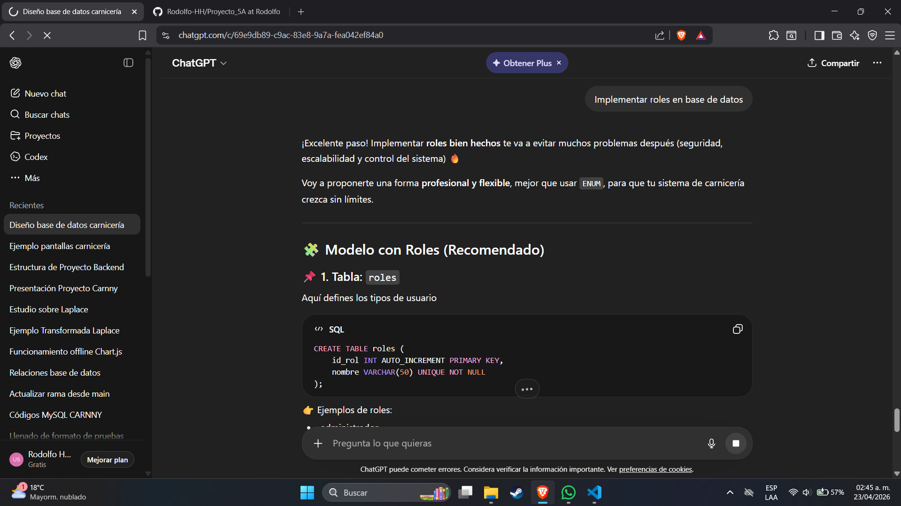
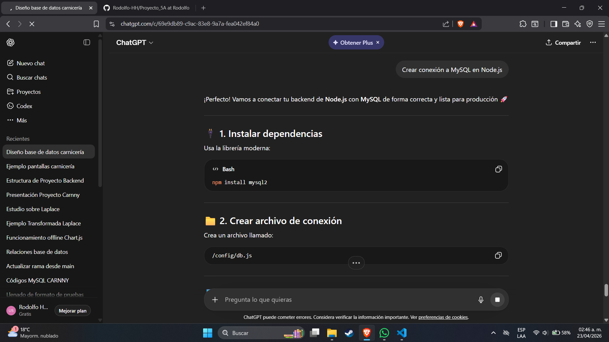

# Bitacora de Proms de ChatGPT para resolver dudas y errores

Durante el desarrollo del sistema se utilizó inteligencia artificial como apoyo para la generación, mejora y optimización de código. A continuación, se presenta una bitácora que documenta los prompts utilizados, los resultados obtenidos y las mejoras aplicadas.

| Fecha      | Objetivo            | Prompt utilizado                             | Resultado         | Mejora aplicada                     | Resultado final        |
| ---------- | ------------------- | -------------------------------------------- | ----------------- | ----------------------------------- | ---------------------- |
| 20/04/2026 | Crear base de datos | Diseña una base de datos para una carnicería | Estructura básica | Se agregaron relaciones y roles     | Base de datos completa |
| 21/04/2026 | Login               | Crear formulario de inicio de sesión en HTML | Código simple     | Se mejoró con validaciones          | Login funcional        |
| 22/04/2026 | CSS                 | Diseña un formulario centrado                | Estilos básicos   | Se ajustaron colores y layout       | Diseño profesional     |
| 23/04/2026 | Seguridad           | Implementar roles en base de datos           | Uso de DEFAULT    | Se agregó control con procedimiento | Seguridad mejorada     |
| 24/04/2026 | Backend             | Crear conexión a MySQL en Node.js            | Conexión básica   | Se manejaron errores                | Backend funcional      |

## Evidencias de uso de IA

  

  

  

  

  

## Proceso de Mejora

Cada prompt fue refinado mediante iteraciones, permitiendo:

Mejorar la precisión de las respuestas
Adaptar el código a los requerimientos del sistema
Optimizar la estructura de la base de datos
Implementar buenas prácticas de desarrollo

## Conclusión

El uso de prompting permitió acelerar el desarrollo del sistema, facilitando la generación de soluciones técnicas y su mejora continua. La documentación de este proceso evidencia el uso estratégico de herramientas de inteligencia artificial dentro del proyecto.