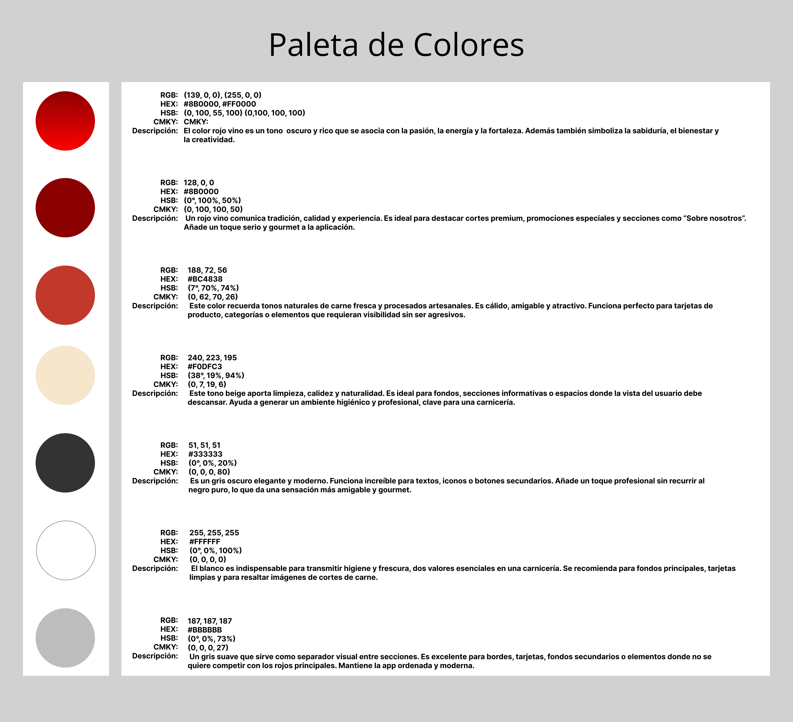
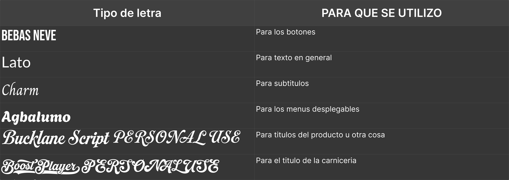
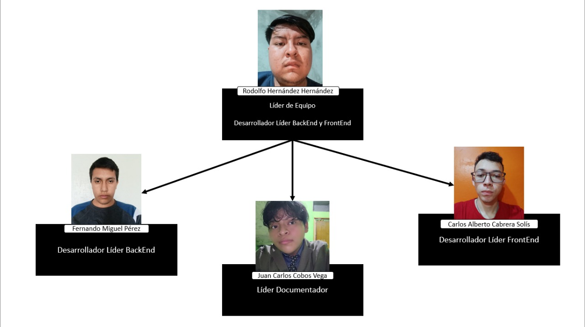
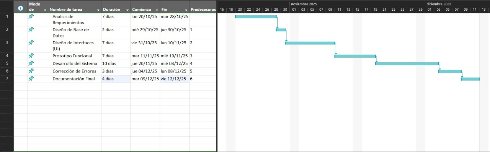

<table width="80%" margin="1">
<tr>
<td width="50%" align="center"></td>
<td width="100%" align="center"></td>
</tr>
</table>

# Universidad Tecnologica de Xicotepec de Juarez

## T.S.U. en Desarrollo de Software Multiplataforma

### Integrantes del equipo, grado y grupo:

**Nombre del equipo:** 
## Legacy of the Final Code
**Nombre del producto:**
## Proyecto - Carnny

### Integrantes:

**Rodolfo Hernández Hernández 5º "A"**  
**Fernando Miguel Pérez 5º "A"**  
**Carlos Alberto Cabrera Solís 5º "A"**  
**Juan Carlos Cobos Vega 5º "A"**  

<table width="80%" margin="1">
<tr>
<td>Logo de la aplicación</td>
<td>Logo del equipo</td>
</tr>
<tr>
<td width="50%" align="center"></td>
<td width="100%" align="center"></td>
</tr>
</table>

### Paleta de colores

### Tipografias

### Descripcion general

La aplicación web de la carnicería es una herramienta digital diseñada para apoyar la gestión administrativa y operativa del negocio, facilitando el control eficiente de sus procesos internos. Esta plataforma está orientada principalmente a los usuarios administradores y cajeras(os), quienes requieren un sistema confiable para organizar la información y atender a los clientes de manera ágil.

A través de la aplicación web, es posible administrar el catálogo de productos, incluyendo los diferentes cortes de carne, precios, categorías y existencias disponibles. Además, el sistema permite llevar un control del inventario, ayudando a mantener actualizados los niveles de stock y evitando faltantes o pérdidas. La gestión de clientes también forma parte fundamental de la plataforma, ya que se pueden registrar, consultar y actualizar sus datos para mejorar la atención y el seguimiento de compras.

Otro módulo importante es el registro de ventas, el cual permite a las cajeras(os) realizar transacciones de forma rápida y segura, aplicando promociones o descuentos cuando corresponda. Asimismo, la aplicación ofrece la posibilidad de administrar recetas y promociones, información que posteriormente puede ser consultada por los clientes desde la aplicación móvil complementaria.

La interfaz de la aplicación web está diseñada como un panel administrativo, con formularios claros, tablas organizadas y opciones de navegación intuitivas, lo que mejora la eficiencia del trabajo diario. En conjunto, esta aplicación web contribuye a optimizar los procesos de la carnicería, mejorar el control de la información y brindar un mejor servicio al cliente. 

### Objetivo General

Desarrollar e implementar una aplicación web orientada a la gestión administrativa y operativa de una carnicería, que permita centralizar y organizar de manera eficiente la información relacionada con el catálogo de productos, el control de inventario, el registro y seguimiento de clientes, así como el proceso de ventas diarias. La aplicación busca apoyar el trabajo del personal administrativo y de las cajeras(os), proporcionando herramientas digitales que faciliten la captura, consulta, actualización y control de datos de forma segura y ordenada.

Así mismo, la aplicación web tiene como objetivo optimizar los procesos internos del negocio, reduciendo errores en el manejo de información, mejorando el control de existencias y agilizando la atención al cliente en el punto de venta. Mediante una interfaz intuitiva y fácil de usar, el sistema permitirá administrar promociones, descuentos y recetas, información que podrá ser compartida con los clientes a través de una aplicación móvil complementaria.

Finalmente, el desarrollo de esta aplicación web pretende contribuir a la modernización de la carnicería, fortaleciendo la toma de decisiones mediante el acceso oportuno a información actualizada, mejorando la eficiencia operativa y elevando la calidad del servicio ofrecido, apoyándose en el uso de tecnologías web que favorezcan la productividad y el crecimiento del negocio.

### Objetivos Especificos

1. Administrar el catálogo de productos, permitiendo el registro, actualización y eliminación de los diferentes cortes de carne, categorías y precios disponibles en la carnicería.
2. Controlar el inventario de manera eficiente, manteniendo actualizadas las existencias de productos para evitar faltantes, pérdidas o errores en el stock.
3. Gestionar la información de los clientes, facilitando su registro, consulta y actualización para mejorar la atención y el seguimiento de compras.
4. Registrar y controlar las ventas diarias, permitiendo a las cajeras(os) realizar transacciones de forma rápida, aplicar descuentos y generar un historial de ventas.
5. Administrar promociones, descuentos y recetas, con el fin de apoyar las estrategias de venta y brindar información útil que pueda ser compartida con los clientes a través de la plataforma digital.

### Organigrama del Equipo

### Tabla de colaboradores (Roles)

| Nombre | Usuario | Puesto | 
|---------------|--------|--------|
| Rodolfo Hernández Hernández | [@Rodolfo-HH](https://github.com/Rodolfo-HH) | Scrum Master: Lider de Equipo |
| Fernando Miguel Pérez | [@Fernando33368](https://github.com/Fernando33368) | Lider de Desarrollador Backend |
| Carlos Alberto Cabrera Solís | [@CarlosACS21](https://github.com/CarlosACS21) | Lider de Desarrollador Frontend |
| Juan Carlos Cobos Vega | [@cobosjuan5636](https://github.com/cobosjuan5636) | Lider de Desarrollo de Documentación |

### Diagrama de Gannt

### Conclusiones 

### Rodolfo Hernández Hernández
Este proyecto nos ayudó a entender cómo funciona una aplicación web aplicada a un negocio real, en este caso una carnicería, y la importancia de usar la tecnología para organizar mejor la información.

### Carlos Alberto Cabrera Solis 
Aprendimos a administrar productos, clientes, inventario y ventas mediante un sistema web, lo que nos permitió aplicar los conocimientos vistos en clase de una forma práctica.

### Juan Carlos Cobos Vega
El diseño de una interfaz sencilla e intuitiva fue importante para que los usuarios pudieran utilizar el sistema sin complicaciones, mejorando la rapidez y eficiencia del trabajo diario.

### Fernando Miguel Perez
El desarrollo de este proyecto fortaleció el trabajo en equipo y la organización, ya que fue necesario planear, documentar y coordinar cada etapa para lograr un buen resultado final.
